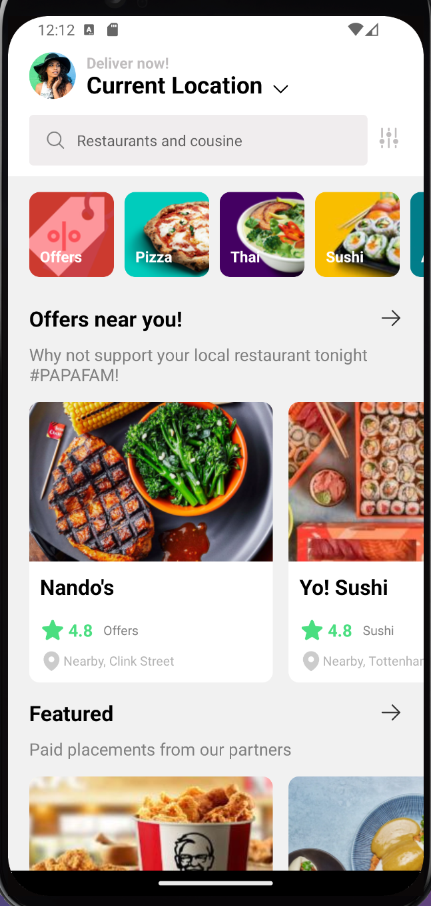
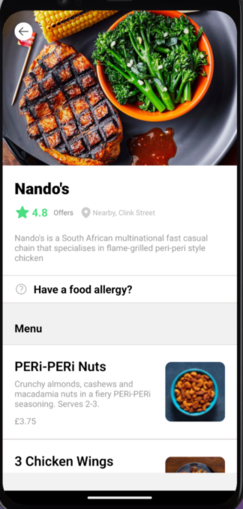
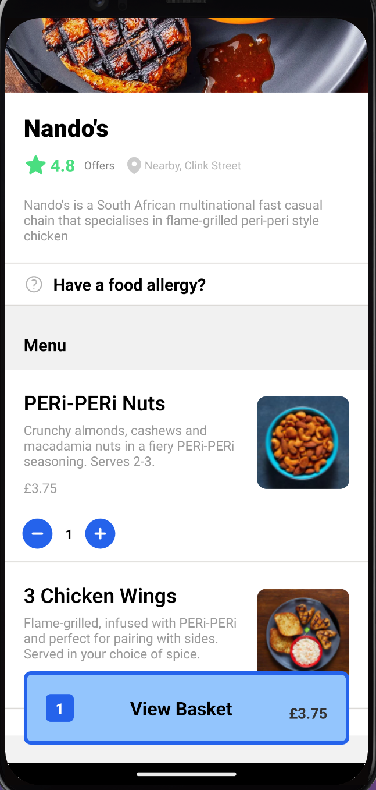
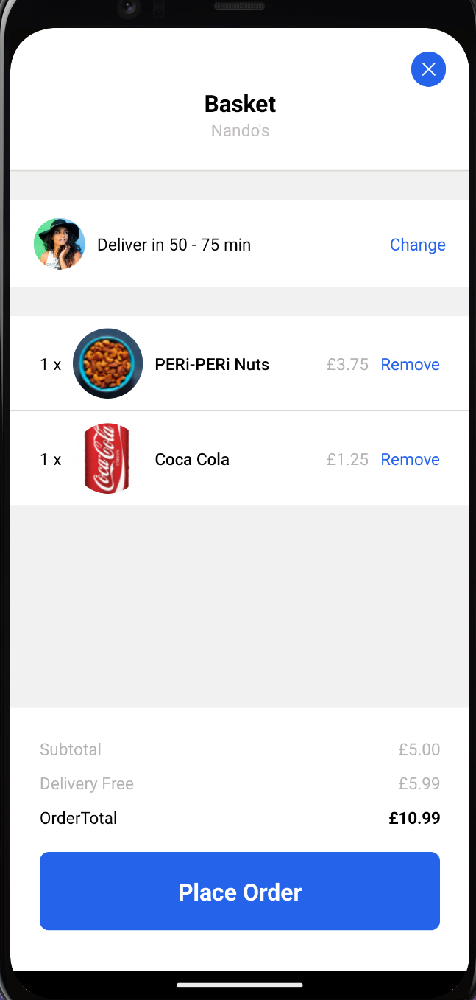
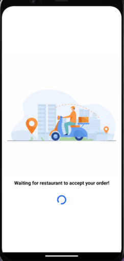
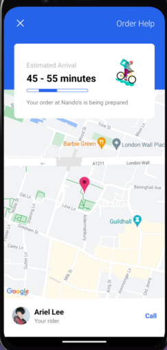

## 🧐 Deliveroo

> This is a mobile app made with React Native (expo) and Styled Components, which consumes data from the sanity CMS and it has maps integrated.

     

## 🔧 Built With

- react-navigation
- sanity/client
- react-native-maps
- react/react-native
- redux
- heroicons
- styled-components
- expo

## 🛠 Getting Started

To get a local copy up and running follow these simple example steps.

- Go to the main page of te repo.
- Press the `Code` button and get the repo link.
- Clone it using git.

## ✒️ Authors

👤 **Unicorn Dad**

- [@UnicornDad8](https://github.com/UnicornDad8)

👤 **Sonny Sangha**

- [@sonnysangha](https://github.com/sonnysangha)

## 🤝 Contributing

Contributions, issues and feature requests are welcome!

Feel free to check the [issues page](https://github.com/UnicornDad8/deliveroo/issues).

## 📝 License

This project is [MIT](lic.url) licensed.

## Kind Regards

👤 **Sonny Sangha**

- [@sonnysangha](https://github.com/sonnysangha)

#### [Live Tutorial](https://www.youtube.com/watch?v=taPz40VmyzQ&t=372s)
